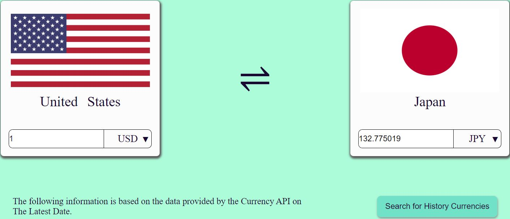
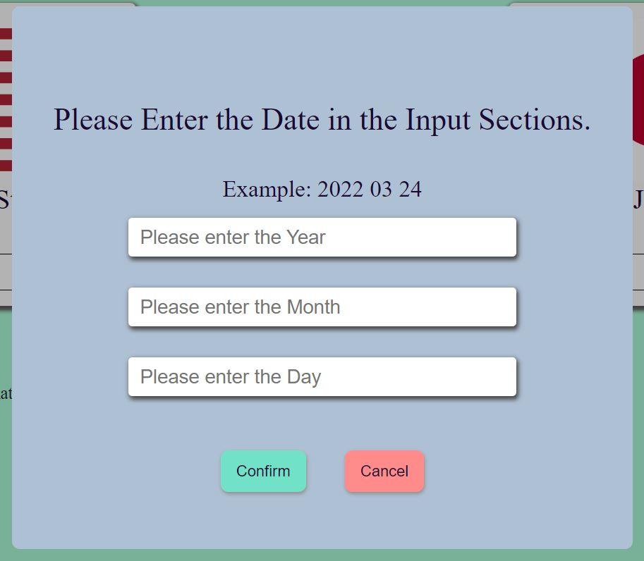
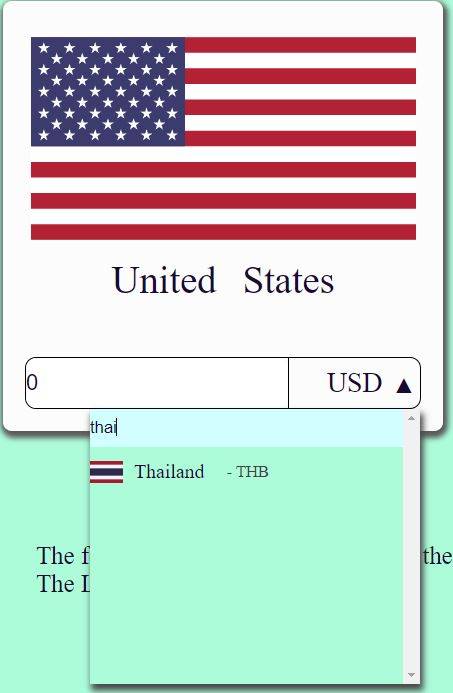
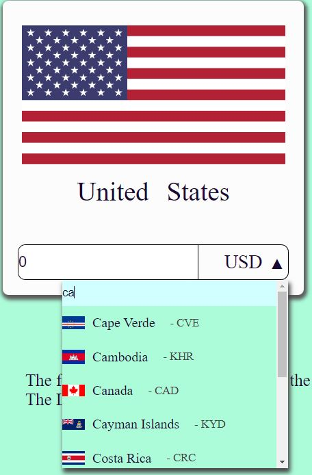

# Currency Exchanger 匯率轉換器
### 本專案基於Currency API 與 Rest Countries 所實踐而成。
### 使用Vue與Axios技術，並使用Vue Cli 開發環境。

<br/>

# 設計理念：
### 意旨在解決貨幣轉換的問題。
### 於是決定使用網路熱門的API，自行開發出來一個匯率轉換Side Project

<br/>

# 本專案特色
### 清楚標示的圖片與國家名稱，清楚標明的資訊
### 

### 可以自行選擇最多一年前的貨幣資訊(感謝Currency API)
### 

### 清楚標示的圖片與國家名稱，清楚標明的資訊
### 
### 
<br>

<br/>

# 所使用的API連結
### Currency API (https://github.com/fawazahmed0/currency-api)
### Rest Countries (https://restcountries.com/)
<br>

# 如何安裝建置此APP

### 建置的第一步驟 (Project setup)
```
npm install
```

### 建置完成之後進入開發階段開啟APP (Compiles and hot-reloads for development)
```
npm run serve
```

<!-- ### Compiles and minifies for production
```
npm run build
```

### Lints and fixes files
```
npm run lint
```

### Customize configuration
See [Configuration Reference](https://cli.vuejs.org/config/). -->
